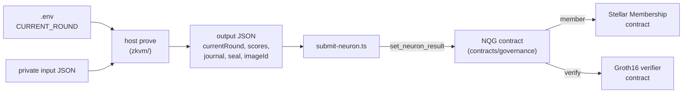

# Neuron scores proven with RISC Zero and stored on Stellar

This repository computes neuron scores for Stellar Community Fund members,
proves with [RISC Zero](https://risczero.com/) that the scores were computed
correctly, and stores them on Stellar together with the proof, in the Neural
Quorum Governance (NQG) contract that turns them into voting powers. The
private input never leaves the machine that generates the proof. Only the
scores and the proof are published.

The system has three parts:

| Part | Path | What it does |
| --- | --- | --- |
| Prover | [`zkvm/`](zkvm) | Runs a neuron inside the RISC Zero zkVM and produces a Groth16 proof plus one output JSON file |
| Submit script | [`scripts/submit-neuron.ts`](scripts/submit-neuron.ts) | Reads the output JSON and sends the scores and the proof to the contract |
| Contract | [`contracts/governance/`](contracts/governance) | The NQG contract. Checks the proof with the Groth16 verifier, stores the scores per layer, neuron and round, and computes the voting powers |

The proof is checked on chain by the Groth16 verifier contract from
[NethermindEth/stellar-risc0-verifier](https://github.com/NethermindEth/stellar-risc0-verifier).
This repository does not contain that contract. It is deployed once and the
NQG contract calls it.

The NQG contract also requires every scored id to be an active member of the
Stellar Membership contract, which lives in a separate repository. The
contract's own README, [`contracts/governance/README.md`](contracts/governance/README.md),
covers its whole interface, the error codes and the link to the membership
contract.


## Contents

- [How it works](#how-it-works)
- [Requirements](#requirements)
- [The zkVM prover](#the-zkvm-prover)
- [Build the prover](#build-the-prover)
- [Generate a proof](#generate-a-proof)
- [Submit the scores](#submit-the-scores)
- [Calculate the voting powers](#calculate-the-voting-powers)
- [Read the results](#read-the-results)
- [The contract](#the-contract)
- [What is proven and what is trusted](#what-is-proven-and-what-is-trusted)
- [After changing a neuron](#after-changing-a-neuron)


## How it works



1. You put the round being scored in `.env` in the repository root.
2. `host prove` runs the selected neuron as a guest program in the zkVM with
   the private input file. The guest calculates the scores and commits the
   round and the scores as its public output, the journal. The prover wraps the
   run in a Groth16 proof and writes one output JSON file.
3. `submit-neuron.ts` reads that file, checks that its round is the contract's
   active round, scales every score to an integer with 6 decimal places, and
   calls `set_neuron_result` on the NQG contract for the layer and neuron you
   name.
4. The contract checks that the caller is the admin and that every scored id
   is an active member, hashes the journal, and asks the Groth16 verifier
   whether the proof matches the journal and the neuron's Image ID. Only when
   all checks pass does it store the scores and the proof under that layer,
   neuron and round. A failed check stores nothing.
5. When every neuron has scores for the round, the admin calls
   `calculate_voting_powers`, and the contract weighs and adds up the scores
   into each member's voting power.


## Requirements

For proving:

- [Rust](https://rustup.rs/). `zkvm/` uses the stable toolchain from
  [`zkvm/rust-toolchain.toml`](zkvm/rust-toolchain.toml).
- [`rzup`](https://github.com/risc0/risc0/blob/main/risc0/cargo-risczero/README.md)
  and `r0vm` 3.0.6. The host calls this binary to prove locally. No remote
  prover is used.

  ```sh
  curl -L https://risczero.com/install | bash
  rzup install r0vm 3.0.6
  rzup use r0vm 3.0.6
  ```

- Docker with BuildKit support. Choose the path for your setup:

  **Path 1: You already have Docker Desktop**

  Start Docker Desktop. It includes Buildx and BuildKit, so no separate
  Docker or Buildx installation is needed. Continue to the verification
  commands below.

  **Path 2: You do not have Docker Desktop (Apple Silicon Mac)**

  Install Colima, the Docker CLI and Buildx with
  [Homebrew](https://formulae.brew.sh/formula/docker-buildx):

  ```sh
  brew install colima docker docker-buildx
  mkdir -p "$HOME/.docker/cli-plugins"
  ln -sfn "$(brew --prefix)/opt/docker-buildx/bin/docker-buildx" \
    "$HOME/.docker/cli-plugins/docker-buildx"
  ```

  If you already use Colima, install only missing packages. The symlink
  makes the Homebrew plugin discoverable by Docker, as described in the
  [Colima setup instructions](https://github.com/abiosoft/colima/blob/main/docs/FAQ.md#docker-buildx-plugin-is-missing).

  Give the virtual machine 8 GiB of memory; with the default 2 GiB the
  Groth16 container is killed. Enable Rosetta because the guest builder
  exists only for `linux/amd64`, and QEMU emulation is much slower:

  ```sh
  colima start --vm-type vz --vz-rosetta --memory 8 --cpu 4
  ```

  If Colima is already running, run `colima stop` before applying these
  settings. Later `colima start` calls keep them. If the existing virtual
  machine uses QEMU and refuses these settings, recreate it with
  `colima delete` and run the start command again. This deletes the images
  and containers stored in Colima.

  **Verify either path**

  After starting Docker Desktop or Colima, verify the plugin and the
  connection to Docker:

  ```sh
  docker buildx version
  docker info
  ```

  Docker is used twice. Building the prover compiles the guests in
  `risczero/risc0-guest-builder:r0.1.91.1`, pinned by SHA-256 digest in
  [`zkvm/methods/build.rs`](zkvm/methods/build.rs). Proving runs
  `risczero/risc0-groth16-prover:v2025-04-03.1`, which `r0vm` starts to turn
  the proof into Groth16.

For submitting:

- [Stellar CLI](https://developers.stellar.org/docs/tools/developer-tools/cli/install-cli).
- Node.js 22.18 or newer. The submit script is TypeScript that Node runs
  directly. It has no runtime npm dependencies, so `npm install` is not needed.


## The zkVM prover

The current prover supports three neurons:

| `--neuron` | Private input | Scoring logic | Example input |
| --- | --- | --- | --- |
| `prior-voting-history` | `users`, `usersRoundHistory`, `votesPerRound`, `submittersPerRound` | Voting-history and active-participation bonuses | [`example_prior_voting_history.json`](zkvm/data/example_prior_voting_history.json) |
| `assigned-reputation` | `users`, each with `id`, `tier`, `discord_roles` | Reputation-tier bonus plus Discord-role bonuses | [`example_assigned_reputation.json`](zkvm/data/example_assigned_reputation.json) |
| `trust-graph` | `users`, `trustedForUser` | Normalized PageRank with bonuses for trust from highly trusted users and filled trust lists | [`example_trust_graph.json`](zkvm/data/example_trust_graph.json) |

The implementation is split into:

- [`zkvm/core/`](zkvm/core): shared input types, validation and scoring logic.
- [`zkvm/methods/`](zkvm/methods): one guest program per neuron. Each reads the
  round and private input, calculates scores, and commits the output journal.
  The build embeds each compiled guest and its Image ID into the host.
- [`zkvm/host/`](zkvm/host): reads JSON and `.env`, calls local `r0vm` with
  Groth16 proving enabled and development mode disabled, then decodes the
  journal and writes the submission file.


## Build the prover

Start Docker first: the build compiles the guests inside the guest builder
image and fails if Docker is not running.

```sh
cargo build --release --locked --manifest-path zkvm/Cargo.toml -p host
```

The first build downloads the guest builder image and might take
several minutes. Later builds reuse Docker's cache.

The binary is `zkvm/target/release/host`. It has two commands:

| Command | What it does |
| --- | --- |
| `host image-id --neuron <neuron>` | Prints the Image ID of the guest compiled into this binary |
| `host prove --neuron <neuron> --input <json> --output <json>` | Generates a proof |

`<neuron>` is `prior-voting-history`, `assigned-reputation` or `trust-graph`.
If `--neuron` is left out, `prior-voting-history` is used, so always pass it.

Print the three Image IDs to compare them with the guest IDs expected by
the existing NQG contract:

```sh
zkvm/target/release/host image-id --neuron prior-voting-history
zkvm/target/release/host image-id --neuron assigned-reputation
zkvm/target/release/host image-id --neuron trust-graph
```

Because the guests are compiled in a pinned Docker image, the same commit gives
the same Image IDs on every machine and in every folder. Anyone can check the
Image IDs in the contract by building that commit and running these commands.


## Generate a proof

### 1. Set the round

`host prove` reads `CURRENT_ROUND` only from a `.env` file in the working
directory or one of its parents. A shell variable with the same name is
ignored. The round is not part of the input file.

```sh
echo "CURRENT_ROUND=33" > .env
```

This replaces the whole file. If `.env` holds other settings, edit the
`CURRENT_ROUND` line instead. `.env` is in `.gitignore`.

### 2. Point RISC Zero at a work directory Docker can see

On macOS the default work directory is under `/var/folders`, which Colima does
not mount, so the Groth16 container would see no files. Run this in the same
terminal as `host prove`:

```sh
mkdir -p "$HOME/.risc0/groth16-work"
export RISC0_WORK_DIR="$HOME/.risc0/groth16-work"
```

### 3. Prove

Docker must be running. Create the output directory once:

```sh
mkdir -p zkvm/artifacts
```

Assigned reputation, the faster example:

```sh
zkvm/target/release/host prove --neuron assigned-reputation \
  --input zkvm/data/example_assigned_reputation.json \
  --output zkvm/artifacts/assigned-reputation-33.json
```

Prior voting history:

```sh
zkvm/target/release/host prove --neuron prior-voting-history \
  --input zkvm/data/example_prior_voting_history.json \
  --output zkvm/artifacts/prior-voting-history-33.json
```

Trust graph:

```sh
zkvm/target/release/host prove --neuron trust-graph \
  --input zkvm/data/example_trust_graph.json \
  --output zkvm/artifacts/trust-graph-33.json
```

The files in `zkvm/data/` are synthetic. Use your private input file for real
data. Proving takes several minutes.

`host prove` never overwrites files. Each run needs a new `--output` path, and
its parent directory must exist. The path is checked after proving, so pick a
new name before you start. Putting the round in the
file name is a simple way to keep them apart.

### The output file

`--output` holds everything needed on chain, from a single run:

```json
{
  "currentRound": 33,
  "scores": {
    "0": 1.5,
    "1": 2.25
  },
  "journal": "<hex>",
  "seal": "<hex>",
  "imageId": "<64 hex characters>"
}
```

| Field | What it is |
| --- | --- |
| `currentRound` | The round from `.env`, as proven in the journal |
| `scores` | Person (membership token) id to score, decoded from the journal |
| `journal` | Raw journal bytes, hex |
| `seal` | Groth16 proof with the 4-byte selector, hex |
| `imageId` | Image ID of the guest that produced the proof |

Keep the `--output` file. It is what you submit, and it is the only copy of
the proof.


## Submit the scores

Before submitting, obtain the existing NQG contract ID, the configured layer
and neuron IDs for the selected guest, and the contract's active round from
the contract administrator. Build the prover from the commit matching the
contract's guest Image IDs; otherwise it rejects the proof. The membership
and Groth16 verifier contracts must already be connected to NQG.

The Stellar CLI must have the admin identity used as `--source`, and that
account must exist on the selected network. The script requires its
authorization and submits a transaction that pays a fee. The `0` and `1`
layer and neuron IDs below are examples; replace them with your configured
IDs.

```sh
node scripts/submit-neuron.ts \
  --neuron assigned-reputation \
  --output zkvm/artifacts/assigned-reputation-33.json \
  --layer-id 0 \
  --neuron-id 1 \
  --contract "<CONTRACT_ID>" \
  --source admin \
  --network testnet
```

All seven flags are required and unknown flags are rejected. `--neuron` must
match the neuron that produced the output file, as in `host prove`; with the
wrong neuron, the verifier rejects the proof because the Image ID differs.


The script:

1. Reads `currentRound`, `scores`, `journal`, and `seal` from the output file.
2. Checks that every id is a decimal `u32`.
3. Converts each score to text and scales it to an integer with 6 decimal places.
4. Asks the contract for its active round and stops if it is not
   `currentRound`. The contract stores the scores under its active round, not
   under the round in the file.
5. Asks the contract for the neuron and stops if it does not exist. The
   contract would otherwise store the scores under any layer and neuron id.
6. Prints the neuron's name and runs:

   ```sh
   stellar contract invoke --id <CONTRACT_ID> --source <SOURCE> --network <NETWORK> \
     -- set_neuron_result \
     --layer_id 0 \
     --neuron_id 1 \
     --result '{"0":1500000,"1":2250000}' \
     --guest AssignedReputation \
     --journal <JOURNAL_HEX> \
     --seal <SEAL_HEX>
   ```

Steps 4 and 5 are simulations and cost no fee. The Stellar CLI output is shown
as is. A non-zero exit code means the script stopped or the call failed, and
nothing was stored. The contract refuses the call with `NotAMember` (error 18)
when an id is not an active member, and with `InvalidProof` (error 20) when the
verifier does not accept the proof.

Submitting again for the same layer, neuron and round replaces the stored
scores and proof. Results for other rounds stay unchanged.


## Calculate the voting powers

When every neuron of every layer has scores for the active round, the admin
calculates the voting powers:

```sh
stellar contract invoke --network testnet --source admin --id "<CONTRACT_ID>" \
  -- calculate_voting_powers
```

All layers must cover the same members, otherwise the call fails with
`LayerResultsUsersMismatch` (error 17). A neuron without scores for the round
fails it with `NeuronResultNotSet` (error 7). After replacing any scores,
calculate again.


## Read the results

Anyone can read the stored data. `--send=no` simulates the call and does not
create a transaction or cost a fee. The CLI still needs a `--source` account
that exists on the network, but it can be any account, not only `admin`.

```sh
stellar contract invoke --send=no --network testnet --source admin \
  --id "<CONTRACT_ID>" \
  -- \
  get_voting_powers
```

This returns the map from member id to voting power for the active round,
with 6 decimals, for example `{"0":3000000,"1":13002128}`.
`get_voting_power_for_user --member_id 1` returns one member's.

```sh
stellar contract invoke --send=no --network testnet --source admin \
  --id "<CONTRACT_ID>" \
  -- \
  get_neuron_result --layer_id 0 --neuron_id 1
```

This returns one neuron's scores for the active round, for example
`{"0":3000000,"1":3500000}`. Divide by 10^6 for the original value.

```sh
stellar contract invoke --send=no --network testnet --source admin \
  --id "<CONTRACT_ID>" \
  -- \
  get_neuron_proof --layer_id 0 --neuron_id 1
```

This returns the `seal`, `image_id`, and `journal_digest` that were checked.
For an earlier round use `get_neuron_result_round` and `get_neuron_proof_round`
with `--round`. They return `NeuronResultNotSet` (error 7) and
`NeuronProofNotSet` (error 21) when nothing is stored for that neuron and
round.


## The contract

The NQG contract is a Soroban contract in the [`contracts/`](contracts) Cargo
workspace, using `soroban-sdk` 28. Its
[README](contracts/governance/README.md) lists every function and error code.
The proof check is in
[`contracts/governance/src/verifier.rs`](contracts/governance/src/verifier.rs).

`set_neuron_result(layer_id, neuron_id, result, guest, journal, seal)` step by
step:

1. Requires the admin's signature.
2. Calls `member(id)` on the membership contract for every id in `result` and
   requires each one to be active.
3. Takes the Image ID constant of `guest`: `PriorVotingHistory`,
   `AssignedReputation` or `TrustGraph`.
4. Computes `journal_digest = sha256(journal)`.
5. Calls `verify(seal, image_id, journal_digest)` on the verifier. If the
   verifier rejects the proof or cannot answer, the call fails with
   `InvalidProof`.
6. Stores `result`, and `NeuronProof { seal, image_id, journal_digest }` next
   to it, under the layer, the neuron and the active round.

The contract stores only the journal's digest, which is what `verify` needs.
The full journal is still an argument, so the contract computes the digest
itself and the caller cannot pass a digest that does not belong to the journal.
The journal therefore stays readable in the `set_neuron_result` transaction in
Stellar's transaction history, but not in contract storage, so other contracts
cannot read it.

The tests use a mock verifier, so they check what the contract sends to it,
not a real Groth16 proof. Run them in `contracts/`:

```sh
cd contracts
stellar contract build
cargo test --all-features
```

`stellar contract build` comes first because one test upgrades the contract to
a mock WASM.


## What is proven and what is trusted

A valid proof shows that the guest with this Image ID ran correctly and that
the journal, the round and the scores, is its output. The contract stores
nothing unless such a proof exists for the submitted journal.

What is not proven:

- **The input.** The proof does not show that the voting history, roles, or
  tiers are real or complete, or who supplied them. The input provider is
  trusted.
- **The round.** The proof shows which round the scores were calculated for,
  not that it is the actual current round. The contract does not compare the
  round in the journal with its active round; the submit script does.
- **That the stored scores are the journal's.** The contract does not decode
  the journal. It stores `result` as sent, and the submit script sends the
  scores that `host prove` decoded from the journal. The admin is trusted to
  send matching scores, and anyone can check them: the journal is in the
  `set_neuron_result` transaction, and its digest is stored with the proof.
- **The layer and neuron.** The contract does not tie a guest to a layer or
  neuron. The admin chooses both.

Privacy: the journal contains only the round and the scores. It contains no
votes, participation history, author lists, roles, or tiers, and no commitment
to the input. The scores themselves still reveal something about each
member's activity.

## After changing a neuron

Changes to a guest in `zkvm/methods/` or to a core crate in `zkvm/core/`
can change the Image ID, even removing a comment line, because panic messages
in the binary can contain line numbers. A dependency update or a change to
the pinned Docker builder can change it too.

Rebuild the prover and run `host image-id` for all three neurons. Compare the
IDs with the constants in
[`contracts/governance/src/verifier.rs`](contracts/governance/src/verifier.rs).
If an ID changes, the contract administrator must update the accepted guest
ID before proofs from the new build can be submitted. Until then, use the
prover built from the commit matching the existing contract.
