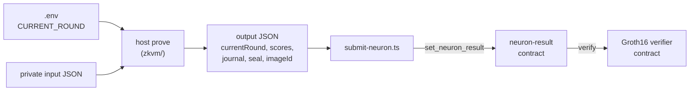

# Neuron scores proven with RISC Zero and stored on Stellar

This repository computes neuron scores for Stellar Community Fund members,
proves with [RISC Zero](https://risczero.com/) that the scores were computed
correctly, and stores them on Stellar together with the proof. The private
input never leaves the
machine that generates the proof. Only the scores and the proof are published.

The system has three parts:

| Part | Path | What it does |
| --- | --- | --- |
| Prover | [`zkvm/`](zkvm) | Runs a neuron inside the RISC Zero zkVM and produces a Groth16 proof plus one output JSON file |
| Submit script | [`zkvm-contracts/scripts/submit-neuron.ts`](zkvm-contracts/scripts/submit-neuron.ts) | Reads the output JSON and sends the scores and the proof to the contract |
| Contract | [`zkvm-contracts/neuron-result/`](zkvm-contracts/neuron-result) | Checks the proof with the Groth16 verifier and stores the scores per neuron and round |

The proof is checked on chain by the Groth16 verifier contract from
[NethermindEth/stellar-risc0-verifier](https://github.com/NethermindEth/stellar-risc0-verifier).
This repository does not contain that contract. It is deployed once and
`neuron-result` calls it.


## Contents

- [How it works](#how-it-works)
- [Requirements](#requirements)
- [Build the prover](#build-the-prover)
- [Deploy the contracts](#deploy-the-contracts)
- [Generate a proof](#generate-a-proof)
- [Submit the scores](#submit-the-scores)
- [Read the scores and the proof](#read-the-scores-and-the-proof)
- [The contract](#the-contract)
- [What is proven and what is trusted](#what-is-proven-and-what-is-trusted)
- [After changing a neuron](#after-changing-a-neuron)


## How it works



1. You put the round being scored in `.env` in the repository root.
2. `host prove` runs the selected neuron as a guest program in the zkVM with
   the private input file. The guest calculates the scores and commits the
   round and the scores as its public output, the journal. The prover wraps the
   run in a Groth16 proof and writes one output JSON file.
3. `submit-neuron.ts` reads that file, scales every score to an integer with
   18 decimal places, and calls `set_neuron_result` on the `neuron-result`
   contract.
4. The contract checks that the caller is the admin, hashes the journal, and
   asks the Groth16 verifier whether the proof matches the journal and the
   neuron's Image ID. Only when the verifier accepts does it store the scores
   and the proof under that neuron and round. A failed check stores nothing.


## Requirements

For proving:

- [Rust](https://rustup.rs/). `zkvm/` uses the stable toolchain from
  [`zkvm/rust-toolchain.toml`](zkvm/rust-toolchain.toml).
- [`rzup`](https://github.com/risc0/risc0/blob/main/risc0/cargo-risczero/README.md)
  and `r0vm` 3.0.6. The host calls this binary to prove locally. No remote
  prover is used.

  ```sh
  curl -L https://risczero.com/install | bash
  rzup install r0vm 3.0.6
  rzup use r0vm 3.0.6
  ```

- Docker with BuildKit support (Docker Desktop or Colima with Docker Buildx).
  Docker Desktop includes Buildx and BuildKit; no separate Buildx installation
  is needed. For an existing Colima setup on macOS, install Buildx with
  [Homebrew](https://formulae.brew.sh/formula/docker-buildx):

  ```sh
  brew install docker-buildx
  mkdir -p "$HOME/.docker/cli-plugins"
  ln -sfn "$(brew --prefix)/opt/docker-buildx/bin/docker-buildx" \
    "$HOME/.docker/cli-plugins/docker-buildx"
  docker buildx version
  ```

  The symlink makes the Homebrew plugin discoverable by Docker, as described
  in the [Colima setup instructions](https://github.com/abiosoft/colima/blob/main/docs/FAQ.md#docker-buildx-plugin-is-missing).
  If starting from scratch with Colima, first run `brew install colima docker`.

  Docker is used twice. Building the prover compiles the guests in
  `risczero/risc0-guest-builder:r0.1.91.1`, pinned by SHA-256 digest in
  [`zkvm/methods/build.rs`](zkvm/methods/build.rs). Proving runs
  `risczero/risc0-groth16-prover:v2025-04-03.1`, which `r0vm` starts to turn
  the proof into Groth16.

  On macOS with Colima, give the virtual machine 8 GiB of memory; with the
  default 2 GiB the Groth16 container is killed. On Apple Silicon also enable
  Rosetta: the guest builder exists only for `linux/amd64`, and without
  Rosetta Colima emulates it with QEMU, which is much slower:

  ```sh
  colima stop
  colima start --vz-rosetta --memory 8 --cpu 4
  ```

  Later `colima start` calls keep these settings. If Colima refuses
  `--vz-rosetta` because the existing virtual machine uses QEMU, recreate it
  with `colima delete` and run the start command again. This deletes the
  images and containers stored in Colima.

  After starting Docker Desktop or Colima, verify both the plugin and the
  connection to Docker:

  ```sh
  docker buildx version
  docker info
  ```

For deploying and submitting:

- [Stellar CLI](https://developers.stellar.org/docs/tools/developer-tools/cli/install-cli).
  Also add the WASM target:

  ```sh
  rustup target add wasm32v1-none
  ```

- Node.js 22.18 or newer. The submit script is TypeScript that Node runs
  directly. It has no runtime npm dependencies, so `npm install` is not needed.


## Build the prover

Start Docker first: the build compiles both guests inside the guest builder
image and fails if Docker is not running.

```sh
cargo build --release --locked --manifest-path zkvm/Cargo.toml -p host
```

The first build downloads the guest builder image and might take
several minutes. Later builds reuse Docker's cache.

The binary is `zkvm/target/release/host`. It has two commands:

| Command | What it does |
| --- | --- |
| `host image-id --neuron <neuron>` | Prints the Image ID of the guest compiled into this binary |
| `host prove --neuron <neuron> --input <json> --output <json>` | Generates a proof |

`<neuron>` is `prior-voting-history` or `assigned-reputation`. If `--neuron`
is left out, `prior-voting-history` is used, so always pass it.

Print both Image IDs. You need them in
[step 3 of the deployment](#3-put-the-image-ids-into-the-contract):

```sh
zkvm/target/release/host image-id --neuron prior-voting-history
zkvm/target/release/host image-id --neuron assigned-reputation
```

Because the guests are compiled in a pinned Docker image, the same commit gives
the same Image IDs on every machine and in every folder. Anyone can check the
Image IDs in the contract by building that commit and running these commands.


## Deploy the contracts

> **Contracts already deployed?** Skip to [Generate a proof](#generate-a-proof).
> You need the `neuron-result` contract id as `<CONTRACT_ID>`, and the admin
> key added to the Stellar CLI with `stellar keys add admin --secret-key`.
> Build the prover from the commit the contract was deployed from; otherwise
> the Image IDs may differ and the contract rejects your proofs.

You deploy the Groth16 verifier, then `neuron-result`.

### 1. Create the accounts

The **deployer** pays for the deployments. The **admin** is the only account
that can call `set_neuron_result`. They can be the same account. On testnet:

```sh
stellar keys generate deployer --network testnet
stellar keys fund deployer --network testnet

stellar keys generate admin --network testnet
stellar keys fund admin --network testnet

stellar keys address admin
```

### 2. Deploy the Groth16 verifier

Skip this step if a Groth16 verifier from `stellar-risc0-verifier` already
exists on your network and you trust that deployment. Then use its contract id
below.

Clone the verifier repository outside this repository and run the following
inside that clone:

```sh
git clone https://github.com/NethermindEth/stellar-risc0-verifier.git
cd stellar-risc0-verifier

stellar contract build --package groth16-verifier

stellar contract deploy \
  --wasm target/wasm32v1-none/release/groth16_verifier.wasm \
  --source-account deployer \
  --network testnet
```

Save the printed contract id as `<VERIFIER_ID>`. Go back to this repository.

The verifier accepts seals whose first 4 bytes match the selector built into
its WASM. Proofs from `r0vm` 3.0.6 match the parameters shipped with the
verifier.

### 3. Put the Image IDs into the contract

The contract has the Image IDs as constants in
[`zkvm-contracts/neuron-result/src/lib.rs`](zkvm-contracts/neuron-result/src/lib.rs):

```rust
const PRIOR_VOTING_HISTORY_IMAGE_ID: [u8; 32] = [ ... ];
const ASSIGNED_REPUTATION_IMAGE_ID: [u8; 32] = [ ... ];
```

Compare both with the output of `host image-id` from
[Build the prover](#build-the-prover). If they differ, replace the bytes. This
command prints an Image ID in the array format:

```sh
zkvm/target/release/host image-id --neuron prior-voting-history \
  | sed 's/../0x&, /g'
```

A contract with a wrong Image ID deploys without error, but every
`set_neuron_result` call for that neuron fails in the verifier.

### 4. Deploy `neuron-result`

```sh
stellar contract build --manifest-path zkvm-contracts/Cargo.toml --package neuron-result

stellar contract deploy \
  --wasm zkvm-contracts/target/wasm32v1-none/release/neuron_result.wasm \
  --source-account deployer \
  --network testnet \
  -- \
  --admin "<ADMIN_ADDRESS>" \
  --verifier "<VERIFIER_ID>"
```

`<ADMIN_ADDRESS>` is the `G...` address printed by `stellar keys address admin`.
The constructor runs once during deployment, and the admin and the verifier
cannot be changed afterwards. Save the printed contract id as `<CONTRACT_ID>`.


## Generate a proof

### 1. Set the round

`host prove` reads `CURRENT_ROUND` only from a `.env` file in the working
directory or one of its parents. A shell variable with the same name is
ignored. The round is not part of the input file.

```sh
echo "CURRENT_ROUND=33" > .env
```

This replaces the whole file. If `.env` holds other settings, edit the
`CURRENT_ROUND` line instead. `.env` is in `.gitignore`.

### 2. Point RISC Zero at a work directory Docker can see

On macOS the default work directory is under `/var/folders`, which Colima does
not mount, so the Groth16 container would see no files. Run this in the same
terminal as `host prove`:

```sh
mkdir -p "$HOME/.risc0/groth16-work"
export RISC0_WORK_DIR="$HOME/.risc0/groth16-work"
```

### 3. Prove

Docker must be running. Create the output directory once:

```sh
mkdir -p zkvm/artifacts
```

Assigned reputation, the faster example:

```sh
zkvm/target/release/host prove --neuron assigned-reputation \
  --input zkvm/data/example_assigned_reputation.json \
  --output zkvm/artifacts/assigned-reputation-33.json
```

Prior voting history:

```sh
zkvm/target/release/host prove --neuron prior-voting-history \
  --input zkvm/data/example_prior_voting_history.json \
  --output zkvm/artifacts/prior-voting-history-33.json
```

The files in `zkvm/data/` are synthetic. Use your private input file for real
data. Proving takes several minutes.

`host prove` never overwrites files. Each run needs a new `--output` path, and
its parent directory must exist. The path is checked after proving, so pick a
new name before you start. Putting the round in the
file name is a simple way to keep them apart.

### The output file

`--output` holds everything needed on chain, from a single run:

```json
{
  "currentRound": 33,
  "scores": {
    "0": 1.5,
    "1": 2.25
  },
  "journal": "<hex>",
  "seal": "<hex>",
  "imageId": "<64 hex characters>"
}
```

| Field | What it is |
| --- | --- |
| `currentRound` | The round from `.env`, as proven in the journal |
| `scores` | Person (membership token) id to score, decoded from the journal |
| `journal` | Raw journal bytes, hex |
| `seal` | Groth16 proof with the 4-byte selector, hex |
| `imageId` | Image ID of the guest that produced the proof |

Keep the `--output` file. It is what you submit, and it is the only copy of
the proof.


## Submit the scores

```sh
node zkvm-contracts/scripts/submit-neuron.ts \
  --neuron assigned-reputation \
  --output zkvm/artifacts/assigned-reputation-33.json \
  --contract "<CONTRACT_ID>" \
  --source admin \
  --network testnet
```

All five flags are required and unknown flags are rejected. `--source` is the
admin identity name in the Stellar CLI, or its secret key. `--neuron` must
match the neuron that produced the output file; with the wrong neuron, the
verifier rejects the proof because the Image ID differs.

The script:

1. Reads `currentRound`, `scores`, `journal`, and `seal` from the output file.
2. Checks that every id is a decimal `u32`.
3. Scales every score to an integer with 18 decimal places, using exact
   decimal arithmetic. `1.5` becomes `1500000000000000000`. Digits after the
   18th are dropped. Scores in exponent notation, such as `1e-7`, are rejected.
4. Runs:

   ```sh
   stellar contract invoke --id <CONTRACT_ID> --source <SOURCE> --network <NETWORK> \
     -- set_neuron_result \
     --neuron AssignedReputation \
     --round 33 \
     --result '{"0":"1500000000000000000","1":"2250000000000000000"}' \
     --journal <JOURNAL_HEX> \
     --seal <SEAL_HEX>
   ```

The Stellar CLI output is shown as is. A non-zero exit code means the call
failed and nothing was stored.

Submitting again for the same neuron and round replaces the stored result.
Results for other rounds stay unchanged.


## Read the scores and the proof

Anyone can read the stored data. `--send=no` simulates the call and does not
create a transaction or cost a fee. The CLI still needs a `--source` account
that exists on the network, but it can be any account, not only `admin`.

```sh
stellar contract invoke --send=no --network testnet --source admin \
  --id "<CONTRACT_ID>" \
  -- \
  get_neuron_result --neuron AssignedReputation --round 33
```

This returns the map from id to score scaled by 10^18. Divide by 10^18 for the
original value.

```sh
stellar contract invoke --send=no --network testnet --source admin \
  --id "<CONTRACT_ID>" \
  -- \
  get_proof --neuron AssignedReputation --round 33
```

This returns the `seal`, `image_id`, and `journal_digest` that were checked. Both
functions return error `NotFound` (code 1) when nothing is
stored for that neuron and round.

The `--neuron` values on chain are `PriorVotingHistory` and
`AssignedReputation`.


## The contract

`neuron-result` is a Soroban contract in its own Cargo workspace,
[`zkvm-contracts/`](zkvm-contracts), using `soroban-sdk` 25.3.0.

| Function | Who can call it | What it does |
| --- | --- | --- |
| `__constructor(admin, verifier)` | Deployment only | Saves the admin and the Groth16 verifier address |
| `set_neuron_result(neuron, round, result, journal, seal)` | Admin | Verifies the proof, then stores `result` and the proof under `(neuron, round)` |
| `get_neuron_result(neuron, round)` | Anyone | Returns `Map<u32, I256>`, id to score scaled by 10^18 |
| `get_proof(neuron, round)` | Anyone | Returns the stored `seal`, `image_id`, and `journal_digest` |

`set_neuron_result` step by step:

1. Requires the admin's signature.
2. Takes the Image ID constant of `neuron`.
3. Computes `journal_digest = sha256(journal)`.
4. Calls `verify(seal, image_id, journal_digest)` on the verifier. If the
   verifier rejects the proof, the whole call fails.
5. Stores `result` and `Proof { seal, image_id, journal_digest }`.

The contract stores only the journal's digest, which is what `verify` needs.
The full journal is still an argument, so the contract computes the digest
itself and the caller cannot pass a digest that does not belong to the journal.
The journal therefore stays readable in the `set_neuron_result` transaction in
Stellar's transaction history, but not in contract storage, so other contracts
cannot read it.


## What is proven and what is trusted

A valid proof shows that the guest with this Image ID ran correctly and that
the journal, the round and the scores, is its output. The contract stores
nothing unless such a proof exists for the submitted journal.

What is not proven:

- **The input.** The proof does not show that the voting history, roles, or
  tiers are real or complete, or who supplied them. The input provider is
  trusted.
- **The round.** The proof shows which round the scores were calculated for,
  not that it is the actual current round.

Privacy: the journal contains only the round and the scores. It contains no
votes, participation history, author lists, roles, or tiers, and no commitment
to the input. The scores themselves still reveal something about each
member's activity.

## After changing a neuron

Changes to a guest in `zkvm/methods/` or to a core crate in `zkvm/core/`
can change the Image ID, even removing a comment line, because panic messages
in the binary can contain line numbers. A dependency update or a change to
the pinned Docker builder can change it too.

After such a change:

1. Rebuild the prover and run `host image-id` for both neurons.
2. Update both constants in
   [`zkvm-contracts/neuron-result/src/lib.rs`](zkvm-contracts/neuron-result/src/lib.rs).
3. Run `cargo test --manifest-path zkvm-contracts/Cargo.toml`.
4. Deploy a new `neuron-result` as in [Deploy the contracts](#deploy-the-contracts),
   steps 3 and 4. Reuse the existing verifier.
5. Use the new contract id from now on. Results stored in the old contract stay
   there; they are not copied.

The contract has no upgrade function and the Image IDs cannot be changed after
deployment.

